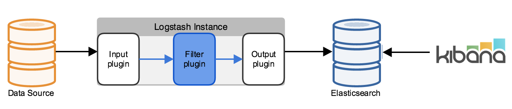

# ELK Stack (Using Docker)


[Source: [Fabian Lee](https://fabianlee.org/2016/11/28/elk-architectural-points-of-extension-and-scalability-for-the-elk-stack/)]

This is a simple guide to get the ELK stack up and running using Docker.

## Prerequisites
- Docker
- Docker Compose

## Files
| Name | Description |
| --- | --- |
| `docker-compose.yml` | Contains the configuration for the Docker Compose. |
| `docker-compose.yml` | Contains the configuration for the Docker Compose. |
| `docker/configs/logstash.conf` | Contains the configuration for Logstash. |
| `docker/logstash` | Contains all the default plugins, and MariaDB connector driver. |
| `app/__init__.py` | Contains the Flask application. |
| `app/models/` | Contains the SQLAlchemy models. |
| `app/views/` | Contains the Flask routes. |

## Installation
1. Clone this repository.
2. Run `docker-compose -p elk-stack up -d --build` in the `docker/` directory of this repository.
3. Wait for the containers to start up.
4. Links to the services:
    - Kibana: http://127.0.0.1:5601
    - Elasticsearch: http://127.0.0.1:9200
    - Logstash: http://127.0.0.1:5959
    - Backend (Flask): http://127.0.0.1:5001
    - MariaDB: http://127.0.0.1:3306
    - PHPMyAdmin: http://127.0.0.1:8001

## Usage
- Kibana
    1. Open Kibana in your browser.
    2. Click on `Management` in the left sidebar.
    3. Click on `Index Patterns`.
    4. Click on `Create Index Pattern`.
    5. Enter `students` in the `Index pattern` field.
    6. Click on `Next step`.
    7. Click on `Create index pattern`.
    8. Click on `Discover` in the left sidebar.
    9. Click on `Add filter`.
    10. Set `Field` to `is_deleted` and `Operator` to `is not` and the value to `true`.
    11. Click on `Apply filter`.
- Adding new Student
    1. Use any REST client to send a `POST` request to the `Backend` service (URI: /students).
    2. Use this JSON as the request body:
    ```json
    {
        "name": "John Doe"
    }
    ```
    3. The response should be a `201` status code with the following JSON:
    ```json
    {
        "id": 1,
        "name": "John Doe",
        "is_deleted": false
    }
    ```
    <b>NOTE:</b> Please note that the changes could take a few seconds to reflect in Kibana.
- Updating a Student
    1. Use any REST client to send a `PUT` request to the `Backend` service (URI: /students/{id}).
    2. Use this JSON as the request body:
    ```json
    {
        "name": "Jane Doe"
    }
    ```
    3. The response should be a `200` status code with the following JSON:
    ```json
    {
        "id": 1,
        "name": "Jane Doe",
        "is_deleted": false
    }
    ```
    <b>NOTE:</b> Please note that the changes could take a few seconds to reflect in Kibana.
- Deleting a Student
    1. Use any REST client to send a `DELETE` request to the `Backend` service (URI: /students/{id}).
    2. The response should be a `200` status code with the following text `Set as Deleted`. The student is not actually deleted from the database, but is marked as deleted.
    3. You can verify this by checking the `students` index in Kibana.
    <b>NOTE:</b> Please note that the changes could take a few seconds to reflect in Kibana.

## License
[MIT](https://choosealicense.com/licenses/mit/)
